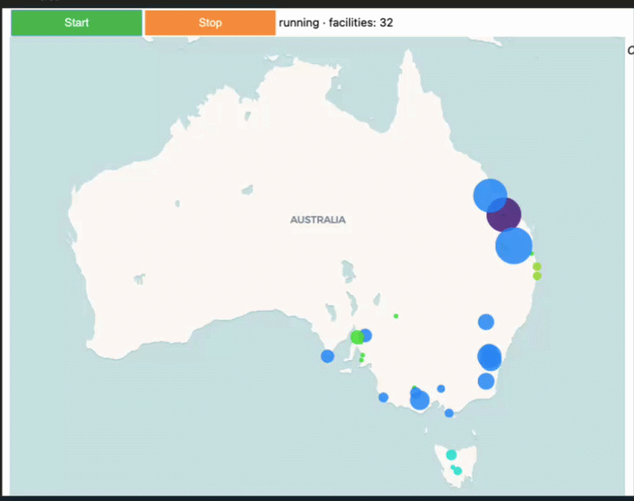

# ⚡ GridPulse — Real-Time Visualisation of Australia's Electricity Network

A two-stage pipeline that ingests live power generation, CO₂ emissions, price, and demand data from Australia's **National Electricity Market (NEM)**, cleans and merges it, and streams it over **MQTT** to a live interactive map — facilities sized by output and colour-coded by fuel type, with click-to-inspect details.


*Replace this with a screen recording of the live map in action.*

---

## 🧭 How It Works

```
OpenElectricity API
        │
        ▼
┌────────────────────────┐
│ 1. INGEST_CLEAN_PUBLISH │   fetch facilities, power, emissions,
│        (notebook)       │   price & demand → clean & merge
└───────────┬─────────────┘
            │  publishes JSON messages
            ▼
      MQTT Broker (test.mosquitto.org)
            │  subscribes to stream
            ▼
┌──────────────────────────────┐
│ 2. SUBSCRIBE_DECODE_VISUALIZE │  decode → normalise → plot live
│          (notebook)           │  on an interactive map
└────────────────────────────────┘
```

1. **Ingest & Publish** — Pulls facility metadata, 5-minute power and emissions data, and market price/demand from the [OpenElectricity API](https://openelectricity.org.au/), cleans and merges it into a single dataset, then streams it as JSON messages over MQTT.
2. **Subscribe & Visualise** — Subscribes to the same MQTT topic, decodes and normalises incoming messages, and renders them on a live-updating Plotly map: marker size reflects current power output, colour reflects fuel type, and clicking a facility shows power, emissions, and price details.

---

## ✨ Features

- Live ingestion of power, emissions, price, and demand across all five NEM regions (NSW, QLD, SA, TAS, VIC)
- Data cleaning pipeline: outlier handling, deduplication, unit normalisation, facility metadata enrichment
- Real-time MQTT publish/subscribe architecture (decoupled ingestion and visualisation)
- Interactive live map (Plotly `FigureWidget`) with fuel-type colour coding and click-to-inspect popups
- Threaded ingestion + rendering loop for smooth, non-blocking updates

---

## 🎨 Fuel Colour Legend

| Fuel | Colour |
|---|---|
| Coal | 🟪 `#4B0082` |
| Gas / Natural Gas | 🟧 `#FF8C00` |
| Solar | 🟨 `#FFD700` |
| Wind | 🟦 `#1E90FF` |
| Hydro | 🟦 `#00CED1` |
| Oil | 🟥 `#8B0000` |
| Diesel | 🟥 `#B22222` |
| Battery | 🟩 `#32CD32` |
| Bioenergy | 🟩 `#9ACD32` |
| Geothermal | 🩷 `#FF69B4` |
| Nuclear | 🟩 `#ADFF2F` |
| Unknown | ⬜ `#A9A9A9` |

---


## 🚀 Getting Started

### 1. Clone the repo
```bash
git clone https://github.com/<your-username>/gridpulse.git
cd gridpulse
```

### 2. Install dependencies
```bash
pip install -r requirements.txt
```

### 3. Set up your API key

Get a free API key from [openelectricity.org.au](https://openelectricity.org.au/).


### 4. Run the pipeline
This project runs as **two separate notebooks/processes** that communicate over MQTT:

**Terminal / Kernel 1 — Ingest & Publish**
```bash
jupyter notebook notebooks/01_ingest_clean_publish.ipynb
```
Fetches and cleans data, then publishes it to the MQTT broker.

**Terminal / Kernel 2 — Subscribe & Visualise**
```bash
jupyter notebook notebooks/02_subscribe_decode_visualize.ipynb
```
Subscribes to the same topic and renders the live map. Click **Start** in the notebook to begin.

> Both notebooks must use the same `MQTT_BROKER` and `TOPIC` values (defaults to `test.mosquitto.org` and a shared topic string — change this if you don't want to share a public test broker with other users).

---

## 🛠️ Tech Stack

- **Python** — pandas, requests
- **MQTT** — paho-mqtt (public broker: `test.mosquitto.org`)
- **Visualisation** — Plotly (`FigureWidget`, `Scattermap`), ipywidgets
- **Data source** — [OpenElectricity API](https://openelectricity.org.au/) (NEM facility, power, emissions, price & demand data)

---

## 📌 Notes & Limitations

- Uses the public `test.mosquitto.org` MQTT broker by default — fine for demos, but swap in a private broker (e.g. HiveMQ Cloud, Mosquitto self-hosted) for anything beyond testing, since the public broker is shared and unauthenticated.
- Facility coordinates are cross-referenced against an auxiliary dataset (`A1_Dataset.csv`) for accuracy where the API's own location data is missing or inconsistent.
- Data window is currently set to a fixed historical week (October 2025) for the ingestion step — adjust `START_DATE` / `END_DATE` for other periods.

---

## 🙋 About

Built as a data engineering + real-time visualisation project exploring Australia's electricity market: ingestion, cleaning, streaming, and live geospatial visualisation end to end.
